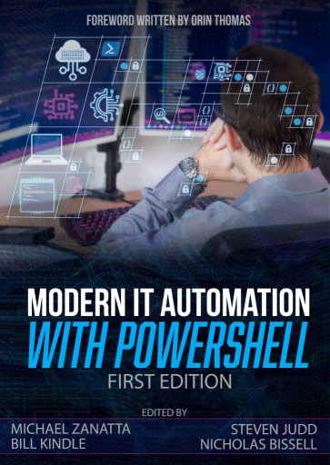

### ☕ `Get-Coffee | Invoke-Brain` 🧠

Hi! 👋

I'm a graduate chemist, software developer, and author with a background in carbon-based (organic) photovolatics, pattern-matching, and data processing.

I mostly work in C# and PowerShell, as well as synthetic chemistry.

### Modern IT Automation with PowerShell

I helped write and edit a book!

If you're interested in taking your PowerShell further, please consider! 100% of profits go to the [DevOps Collective](https://devopscollective.org/)'s [OnRamp Track Scholarships](https://powershellsummit.org/onramp/).

> - [Modern IT Automation with PowerShell on LeanPub](https://leanpub.com/modernautomationwithpowershell)
> - [Modern IT Automation with PowerShell on Amazon](https://www.amazon.com/Modern-Automation-PowerShell-Michael-Zanatta/dp/B0BSC55Y8N)

Here's a list of awesome people that helped make this book possible:

- [ZanattaMichael](https://github.com/ZanattaMichael) (Editor-in-Chief, Author)
- [stevenjudd](https://github.com/stevenjudd) (Senior Editor)
- [billkindle](https://github.com/billkindle) (Senior Editor)
- [alta4096](https://github.com/alta4096) (Author)
- [dohminion](https://github.com/dohminion) (Author)
- [mattcorr](https://github.com/mattcorr) (Author)
- [MichaelLotter](https://github.com/MichaelLotter) (Author)
- [fbinotto](https://github.com/fbinotto) (Author)
- [exchange12rocks](https://github.com/exchange12rocks) (Author, Technical Editor)
- [kjacobsen](https://github.com/kjacobsen) (Author, Technical Editor)
- [KevinLaux](https://github.com/KevinLaux) (Author, Quality Assurance)
- [jborean93](https://github.com/jborean93) (Technical Editor)
- [jhoughes](https://github.com/jhoughes) (Technical Editor)
- [Stahler](https://github.com/Stahler) (Technical Editor)
- [allen-chin](https://github.com/allen-chin) (Linguistic Editor)
- [boxstack](https://github.com/boxstack) (Linguistic Editor)
- [CJZ-14](https://github.com/CJZ-14) (Linguistic Editor)
- [marclancy](https://github.com/marclancy) (Linguistic Editor)
- [Morgorath](https://github.com/Morgorath) (Linguistic Editor)
- [chadmando](https://github.com/chadmando) (Linguistic Editor)
- [ZanattaAmy](https://github.com/ZanattaAmy) (Cover Designer)
- [robderickson](https://github.com/robderickson) (Quality Assurance)
- [essentialexch](https://github.com/essentialexch) (Quality Assurance)
- [psjamesp](https://github.com/psjamesp) (DevOps Collective Sponsor)

### ChemistryCupboard

I also sell chemical samples, pigments, and craft/DIY science supplies.

> - [ChemistryCupboard on Etsy](https://www.etsy.com/shop/ChemistryCupboard/)

<!-- markdownlint-disable-file MD041 MD033 -->
